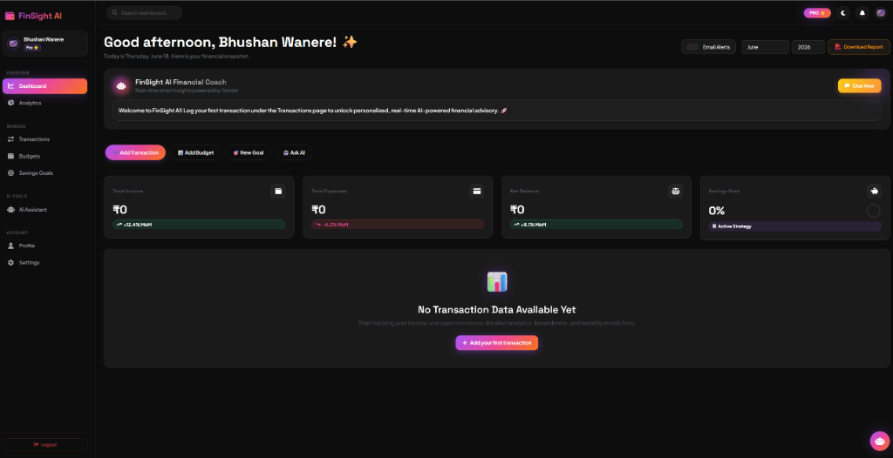

<div align="center">


<br/>

[](https://python.org)
[](https://flask.palletsprojects.com)
[](https://sqlite.org)
[](https://ai.google.dev)
[](https://developer.mozilla.org/en-US/docs/Web/JavaScript)
[](https://getbootstrap.com)

<br/>

[](LICENSE)
[]()
[](CONTRIBUTING.md)
[](https://github.com/bhushan-codes01)
[]()

<br/>

> **FinSight AI** is a full-stack intelligent personal finance management platform.  
> Track your money. Understand your habits. Grow your wealth — with the power of AI.

<br/>

[🚀 Live Demo](#-live-demo) · [✨ Features](#-features) · [⚙️ Installation](#-installation) · [📸 Screenshots](#-screenshots) · [🤝 Contributing](#-contributing)

</div>

---

## 📌 Table of Contents

- [Overview](#-overview)
- [Live Demo](#-live-demo)
- [Screenshots](#-screenshots)
- [Features](#-features)
- [Tech Stack](#-tech-stack)
- [System Architecture](#-system-architecture)
- [Project Structure](#-project-structure)
- [Installation](#-installation)
- [Environment Setup](#-environment-setup)
- [Gemini API Setup](#-gemini-api-setup)
- [Usage](#-usage)
- [API Endpoints](#-api-endpoints)
- [Roadmap](#-roadmap)
- [Contributing](#-contributing)
- [License](#-license)
- [Author](#-author)

---

## 🌟 Overview

**FinSight AI** is a modern, AI-powered personal finance tracker built with **Python Flask** and integrated with **Google Gemini** to provide users with real-time financial insights, smart budgeting strategies, and an intelligent financial assistant — all in one sleek, responsive dashboard.

Whether you want to track daily expenses, set savings goals, visualize spending patterns, or get personalized AI advice on how to manage your money better — FinSight AI has you covered.

```
💡 Built for: Internship Showcases · Hackathons · Placement Portfolios · Real-World Use
```

---

## 🚀 Live Demo

> 🔗 **[Click here to view the live demo](#)** ← *(Deploy to Render/Railway and update this link)*

| Credential | Value |
|:-----------|:------|
| Demo Email | `demo@finsight.ai` |
| Password   | `demo1234` |

---

## 📸 Screenshots

<div align="center">

### 🏠 Landing Page
> *Screenshot placeholder — add `/screenshots/landing.png`*
```
[ Landing Page Screenshot Here ]
```

### 📊 Dashboard
> *Screenshot placeholder — add `/screenshots/dashboard.png`*
```
[ Dashboard Screenshot Here ]
```

### 🤖 AI Assistant
> *Screenshot placeholder — add `/screenshots/chatbot.png`*
```
[ AI Chatbot Screenshot Here ]
```

### 💰 Budget Manager
> *Screenshot placeholder — add `/screenshots/budgets.png`*
```
[ Budget Page Screenshot Here ]
```

</div>

> 📁 **Tip:** Add a `screenshots/` folder to your repo and replace placeholders with real images using:
> ```md
> 
> ```

---

## ✨ Features

### 🔐 Authentication
- Secure user registration and login
- Password hashing with `werkzeug.security`
- Session-based authentication with `login_required` protection
- Flash messages for login/signup feedback

### 📊 Dashboard
- Real-time **Total Income**, **Total Expenses**, **Current Balance**, and **Savings Rate** cards
- **Expense by Category** — interactive Pie/Doughnut chart
- **Monthly Spending Trend** — animated Line chart
- Recent transactions overview (last 10)
- Budget status summary with progress bars

### 💳 Transaction Management
- Add, edit, and delete transactions
- Filter by **category**, **date range**, and **type** (Income/Expense)
- Full-text search across descriptions and categories
- Color-coded income/expense indicators

### 🎯 Budget Management
- Create monthly budgets per category (Food, Travel, Entertainment, etc.)
- Real-time **Used / Remaining / Over Budget** tracking
- Visual progress bars with over-budget warnings 🔴
- Budget vs actual comparison

### 🏦 Savings Goals
- Set custom savings goals with target amounts and deadlines
- Track progress with animated circular progress rings
- AI-powered goal advice via Gemini

### 🤖 AI Financial Assistant
- ChatGPT-style chat interface powered by **Google Gemini**
- Understands your actual transaction data for personalized advice
- Capabilities:
  - 📈 Spending pattern analysis
  - 💡 Personalized savings recommendations
  - 📋 Monthly financial summaries
  - 🎯 AI-generated budget plans
  - 📚 Financial literacy Q&A (SIPs, EMIs, emergency funds, etc.)
  - ⚠️ Smart budget alerts

### 📁 CSV Upload & Analysis
- Upload bank statement CSVs
- AI analysis of spending habits and frequent categories
- Automated categorization suggestions

### 📈 Data Visualization
- Powered by **Chart.js**
- Responsive, animated charts
- Category pie charts, monthly trend lines, budget progress bars

### 🎨 Premium UI/UX
- Dark glassmorphism theme
- Smooth animations and micro-interactions
- Fully responsive (mobile + desktop)
- Custom scrollbar, hover effects, gradient accents

---

## 🛠️ Tech Stack

| Layer | Technology | Purpose |
|:------|:-----------|:--------|
| **Frontend** | HTML5, CSS3, JavaScript (ES6+) | UI structure and interactivity |
| **Styling** | Bootstrap 5.3, Custom CSS | Responsive layout, glassmorphism theme |
| **Charts** | Chart.js | Data visualization |
| **Icons** | Font Awesome 6 | UI icons |
| **Backend** | Python 3.10+, Flask 3.0 | REST API, routing, business logic |
| **Database** | SQLite 3 | Lightweight relational data storage |
| **AI/LLM** | Google Gemini API (`gemini-1.5-flash`) | Financial intelligence & chat |
| **Auth** | Flask-Session, Werkzeug | Secure user authentication |
| **Environment** | python-dotenv | Secrets management |

---

## 🏗️ System Architecture

```
┌─────────────────────────────────────────────────────────┐
│                      CLIENT BROWSER                      │
│         HTML5 · CSS3 · Bootstrap · Chart.js · JS        │
│                                                          │
│   ┌──────────┐  ┌──────────┐  ┌──────────┐  ┌────────┐ │
│   │ Landing  │  │Dashboard │  │Txn/Budget│  │AI Chat │ │
│   └────┬─────┘  └────┬─────┘  └────┬─────┘  └───┬────┘ │
└────────┼─────────────┼─────────────┼─────────────┼──────┘
         │             │   HTTP/AJAX │             │
         └─────────────┴──────┬──────┴─────────────┘
                               │
┌──────────────────────────────▼──────────────────────────┐
│                     FLASK BACKEND                        │
│                                                          │
│  ┌────────────┐  ┌───────────────┐  ┌────────────────┐  │
│  │ routes/    │  │ routes/       │  │ routes/        │  │
│  │ auth.py    │  │ transactions  │  │ chatbot.py     │  │
│  └────────────┘  └───────────────┘  └───────┬────────┘  │
│                                              │           │
│  ┌────────────┐  ┌───────────────┐           │           │
│  │ routes/    │  │ services/     │           │           │
│  │ budget.py  │  │ analytics.py  │           │           │
│  └────────────┘  └───────────────┘           │           │
└──────────────────────────────────────────────┼──────────┘
                    │                           │
         ┌──────────┘                           │
         │                                      │
┌────────▼────────┐               ┌─────────────▼──────────┐
│   SQLITE DB     │               │   GOOGLE GEMINI API     │
│                 │               │                         │
│  users          │               │  gemini-1.5-flash       │
│  transactions   │               │                         │
│  budgets        │               │  • Spending analysis    │
│  chat_history   │               │  • Budget planning      │
│  goals          │               │  • Savings advice       │
└─────────────────┘               │  • CSV analysis         │
                                  └─────────────────────────┘
```

---

## 📁 Project Structure

```
FinSight-AI/
│
├── 📄 app.py                    # Flask app entry point, DB init
├── 📄 requirements.txt          # Python dependencies
├── 📄 .env                      # Environment variables (not committed)
├── 📄 .env.example              # Environment template
├── 📄 .gitignore
├── 📄 README.md
│
├── 📂 database/
│   └── finance.db               # SQLite database (auto-created)
│
├── 📂 routes/
│   ├── auth.py                  # /register /login /logout
│   ├── transactions.py          # CRUD for transactions
│   ├── budget.py                # Budget creation and tracking
│   └── chatbot.py               # Gemini AI chat endpoint
│
├── 📂 services/
│   ├── gemini_service.py        # Gemini API wrapper
│   ├── analytics.py             # Spending analytics logic
│   └── csv_processor.py        # Bank CSV upload & parse
│
├── 📂 models/
│   ├── user.py
│   ├── transaction.py
│   └── budget.py
│
├── 📂 templates/
│   ├── index.html               # Landing page
│   ├── login.html               # Sign in
│   ├── register.html            # Sign up
│   ├── dashboard.html           # Main dashboard
│   ├── transactions.html        # Transaction manager
│   ├── budgets.html             # Budget planner
│   └── chatbot.html             # AI assistant
│
├── 📂 static/
│   ├── css/
│   │   └── style.css            # Global styles + theme
│   ├── js/
│   │   ├── dashboard.js         # Chart rendering + stats
│   │   ├── transactions.js      # CRUD modals + filters
│   │   └── chat.js              # AI chatbot interface
│   └── images/
│       └── logo.png
│
└── 📂 screenshots/              # Add your screenshots here
    ├── landing.png
    ├── dashboard.png
    ├── chatbot.png
    └── budgets.png
```

---

## ⚙️ Installation

### Prerequisites

Make sure you have the following installed:

- [Python 3.10+](https://www.python.org/downloads/)
- [Git](https://git-scm.com/)
- A [Google Gemini API Key](https://aistudio.google.com/app/apikey)

### Step 1 — Clone the Repository

```bash
git clone https://github.com/bhushan-codes01/FinSight-AI.git
cd FinSight-AI
```

### Step 2 — Create a Virtual Environment

```bash
# Create virtual environment
python -m venv venv

# Activate — Windows
venv\Scripts\activate

# Activate — macOS/Linux
source venv/bin/activate
```

### Step 3 — Install Dependencies

```bash
pip install -r requirements.txt
```

### Step 4 — Configure Environment Variables

```bash
# Copy the example env file
cp .env.example .env

# Open .env and fill in your values
nano .env   # or use any text editor
```

### Step 5 — Run the Application

```bash
python app.py
```

### Step 6 — Open in Browser

```
http://localhost:5000
```

> ✅ The SQLite database is created automatically on first run. No setup needed!

---

## 🔐 Environment Setup

Create a `.env` file in the project root. Use `.env.example` as a template:

```env
# ─────────────────────────────────────────
#   FinSight AI — Environment Variables
# ─────────────────────────────────────────

# Flask Configuration
SECRET_KEY=your_super_secret_flask_key_here
FLASK_ENV=development
FLASK_DEBUG=True

# Database
DATABASE_PATH=database/finance.db

# Google Gemini API
GEMINI_API_KEY=your_gemini_api_key_here

# Email Alerts (Optional — Flask-Mail)
MAIL_SERVER=smtp.gmail.com
MAIL_PORT=587
MAIL_USE_TLS=True
MAIL_USERNAME=your_email@gmail.com
MAIL_PASSWORD=your_app_password_here

# App Settings
APP_NAME=FinSight AI
DEFAULT_CURRENCY=INR
```

> ⚠️ **Never commit your `.env` file.** It is already listed in `.gitignore`.

---

## 🤖 Gemini API Setup

FinSight AI uses **Google Gemini** (`gemini-1.5-flash`) for all AI features.

### Get Your API Key

1. Visit [Google AI Studio](https://aistudio.google.com/app/apikey)
2. Sign in with your Google account
3. Click **"Create API Key"**
4. Copy the key and paste it into your `.env` as `GEMINI_API_KEY`

### How It Works

When a user sends a message, the app fetches their transaction data from SQLite and constructs a context-aware prompt:

```python
# services/gemini_service.py

import google.generativeai as genai

genai.configure(api_key=os.getenv("GEMINI_API_KEY"))
model = genai.GenerativeModel("gemini-1.5-flash")

def get_ai_response(user_message, transaction_data):
    prompt = f"""
    You are FinSight, a professional AI financial assistant.

    Here is the user's recent transaction data:
    {transaction_data}

    User Question: {user_message}

    Provide:
    1. A clear summary
    2. Key financial insights
    3. Actionable savings opportunities
    4. Budget recommendations

    Keep your response concise, friendly, and actionable.
    Use Indian Rupee (₹) for amounts.
    """
    response = model.generate_content(prompt)
    return response.text
```

> 💡 The free tier of Gemini API is sufficient for development and demos.

---

## 📖 Usage

### 1. Register an Account
Navigate to `/register` → fill in your name, email, and password → click **Create Account**

### 2. Log In
Go to `/login` → enter credentials → you'll land on your personalized dashboard

### 3. Add Transactions
Click **"Add Transaction"** → enter amount, category, description, date, and type (Income/Expense)

### 4. Set Budgets
Go to **Budgets** page → click **"Add Budget"** → assign monthly limits per category

### 5. Chat with AI
Open the **AI Assistant** page → type questions like:
- *"Analyze my spending this month"*
- *"Create a budget plan for ₹30,000 income"*
- *"How can I save more money?"*
- *"Summarize my June expenses"*

### 6. Upload CSV
Go to **Transactions** → click **"Upload CSV"** → upload your bank statement for AI analysis

---

## 🔌 API Endpoints

| Method | Endpoint | Description | Auth |
|:-------|:---------|:------------|:-----|
| `POST` | `/register` | Register new user | ❌ |
| `POST` | `/login` | User login | ❌ |
| `GET` | `/logout` | Logout session | ✅ |
| `GET` | `/dashboard` | Dashboard data | ✅ |
| `GET` | `/transactions` | List all transactions | ✅ |
| `POST` | `/transactions` | Add new transaction | ✅ |
| `PUT` | `/transactions/<id>` | Update transaction | ✅ |
| `DELETE` | `/transactions/<id>` | Delete transaction | ✅ |
| `GET` | `/budgets` | List budgets | ✅ |
| `POST` | `/budgets` | Create budget | ✅ |
| `GET` | `/goals` | List savings goals | ✅ |
| `POST` | `/goals` | Create savings goal | ✅ |
| `POST` | `/chat` | Send message to AI | ✅ |
| `POST` | `/upload-csv` | Upload bank CSV | ✅ |

---

## 🗺️ Roadmap

| Status | Feature |
|:------:|:--------|
| ✅ | User Authentication (Login / Register) |
| ✅ | Dashboard with financial overview cards |
| ✅ | Income & Expense transaction tracking |
| ✅ | Budget management with progress tracking |
| ✅ | Savings Goals with progress rings |
| ✅ | AI Financial Assistant (Google Gemini) |
| ✅ | Data visualization with Chart.js |
| ✅ | CSV bank statement upload & analysis |
| ✅ | Responsive dark UI (glassmorphism) |
| 🔄 | PDF monthly report generation |
| 🔄 | Email budget alerts (Flask-Mail) |
| 🔄 | Recurring transaction automation |
| 🔄 | Multi-currency support (₹ $ € £) |
| 🔄 | Dark / Light mode toggle |
| 📋 | OCR receipt scanner |
| 📋 | Investment & SIP tracking |
| 📋 | Mobile app (Flutter) |
| 📋 | Bank API integration |
| 📋 | Voice-based AI assistant |

> ✅ Completed · 🔄 In Progress · 📋 Planned

---

## 🤝 Contributing

Contributions are welcome and appreciated! Here's how to get involved:

### Steps to Contribute

```bash
# 1. Fork the repository
# (click Fork button on GitHub)

# 2. Clone your fork
git clone https://github.com/YOUR_USERNAME/FinSight-AI.git

# 3. Create a feature branch
git checkout -b feature/your-feature-name

# 4. Make your changes
# ... code ...

# 5. Commit with a clear message
git commit -m "feat: add your feature description"

# 6. Push to your fork
git push origin feature/your-feature-name

# 7. Open a Pull Request on GitHub
```

### Commit Message Convention

```
feat:     New feature
fix:      Bug fix
style:    UI/CSS changes
refactor: Code restructuring
docs:     Documentation update
test:     Adding tests
```

### Guidelines

- Follow the existing code style
- Comment complex logic
- Test your changes before submitting a PR
- Update the README if you add new features

---

## 📄 License

```
MIT License

Copyright (c) 2025 Bhushan Wanere

Permission is hereby granted, free of charge, to any person obtaining a copy
of this software and associated documentation files (the "Software"), to deal
in the Software without restriction, including without limitation the rights
to use, copy, modify, merge, publish, distribute, sublicense, and/or sell
copies of the Software.

THE SOFTWARE IS PROVIDED "AS IS", WITHOUT WARRANTY OF ANY KIND.
```

See the full [LICENSE](LICENSE) file for details.

---

## 👨‍💻 Author

<div align="center">


### Bhushan Wanere

*Full Stack Developer · AI Enthusiast · Building cool things with code*

[](https://github.com/bhushan-codes01)
[](https://linkedin.com/in/YOUR_LINKEDIN_HERE)
[](mailto:your.email@gmail.com)

</div>

---

## 🙏 Acknowledgements

- [Google Gemini](https://ai.google.dev) — for the powerful AI API
- [Flask](https://flask.palletsprojects.com) — for the lightweight backend framework
- [Chart.js](https://www.chartjs.org) — for beautiful data visualization
- [Bootstrap](https://getbootstrap.com) — for the responsive UI framework
- [Font Awesome](https://fontawesome.com) — for the icon library
- [Shields.io](https://shields.io) — for the beautiful badges

---

<div align="center">


**⭐ If you found this project helpful, please give it a star!**

*Made with ❤️ by [Bhushan Wanere](https://github.com/bhushan-codes01)*

</div>
